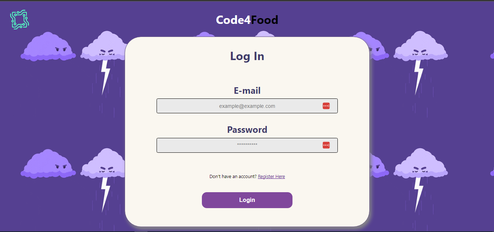
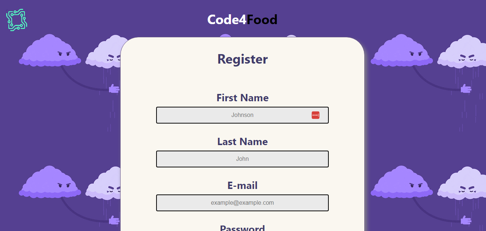
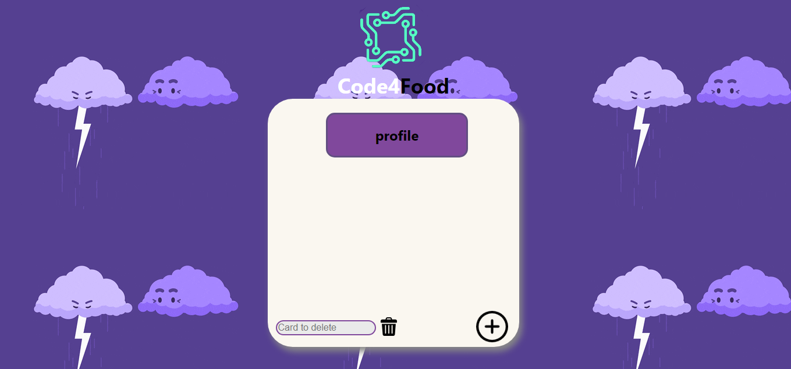
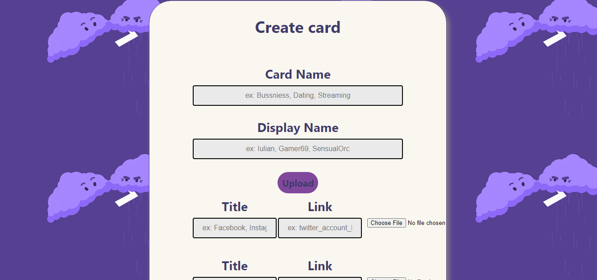
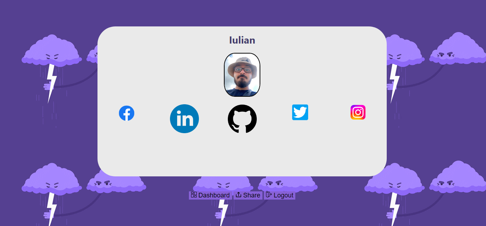

# unihack2022

## This is SocialCard.

### A project that is made by people for people.
### This project is a website that has the main goal of helping people digitalize their business cards aka share their socials easier.

### Provides simple connectivity with a simple to use authentification.

### After joining the SocialCard family you are welcomed to the Dashboard page where you can make card as many as you want.

### With simplicity in mind, you can add five social links in the CreateCard page

### And 'la pièce de résistance' the card

## Our Team 
- **Pop Iulian**: Front End developer
- **Poenaru Iulian**: BackEnd developer
- **Raevschi Cătălin**: Front End developer

` This project is in the preAlpha release `
